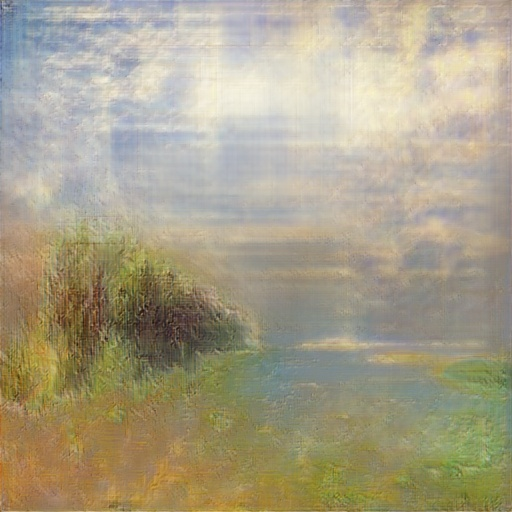
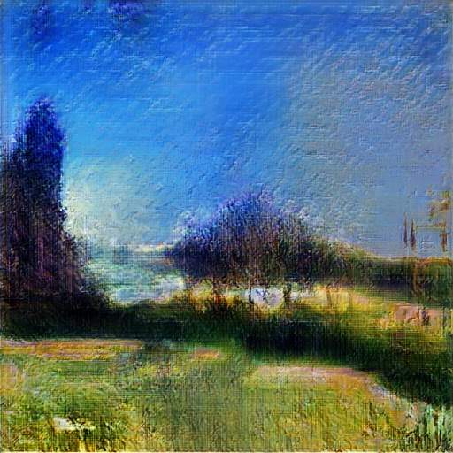

# keragan

## Keras implementation of GANs

This library provides some simple infrastructure to define and train Generative Adversarial Networks in Keras. It can also be used from the command line.

### Installation

The simplest way to install is:
```bash
pip install keragan
```

### Some Images produced by keragan

Images were trained on [WikiArt.org](http://wikiart.org) dataset taken from [here](https://github.com/cs-chan/ArtGAN/blob/master/WikiArt%20Dataset/README.md).

||||
|---|---|---
| *Minimalistic Landcape*, 2020 | *Spring Dawn*, 2020 | *Water Still 2*, 2020 |
|---|---|---

### Training GAN from the Command-Line

To start training, you can use the following command-line:
```bash
python -m keragan.trainer c:\dataset --size 1024 --model_path .\models --samples_path .\samples --latent_dim 100 --epochs 1000
```

You can find out more about other parameters by calling the program with `--help` option.

Important things to note:
* `--size` must be power of 2, suitable values are 64, 128, 256, 512 and 1024. Higher resoltions are likely not to give good results.
* You can use `--lr` to set learning rate, default value is 0.001. Smaller learning rates yield better results, but may significantly increase training time.

### Generating Images

Once you have trained the model, you can use the generator model to produce new random images. To do that from a command line, you can use the following:

```bash
python -m keragan.generate --file ./models/gen_1100.hdf5 --out ./samples --n 100
```

Use `--help` option to find out more about different options.

### Architecture 

The library is structured around few core classes:
* `GAN` is used to represent a GAN, with `generator` and `discriminator` fields that define corresponding networks. `GAN` itself is abstract, and any subclass should define `create_generator()` and `create_discriminator()` functions. This class is also responsible for loading/saving networks to disk, and it can also generate sample images using `sample_images` method.
* `DCGAN` is currently the only subclass, implementing Deep Convolutional GAN.
* `ImageDataset` is a class defining the process of loading initial dataset from disk, resizing it to specified size, filtering out bad images, etc.
* `GANTrainer` is responsible to training a GAN, i.e. running epoch loop and periodically storing samples and network weights to disk. 

The actual training code looks like this:
```python
    gan = keragan.DCGAN.from_args(args)
    imsrc = keragan.ImageDataset.from_args(args)
    imsrc.load()
    if args.sample_images:
        imsrc.sample_images()

    train = keragan.GANTrainer(image_dataset=imsrc,gan=gan,args=args)
    
    def callbk(tr):
        if args.visual_inspection_interval and tr.gan.epoch % args.visual_inspection_interval == 0:
            res = tr.gan.sample_images(n=2)
            fig,ax = plt.subplots(1,len(res))
            for i,v in enumerate(res):
                ax[i].imshow(v[0])
            plt.show()

    train.train(callbk)
```
